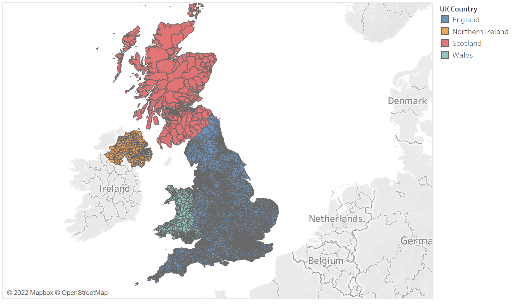
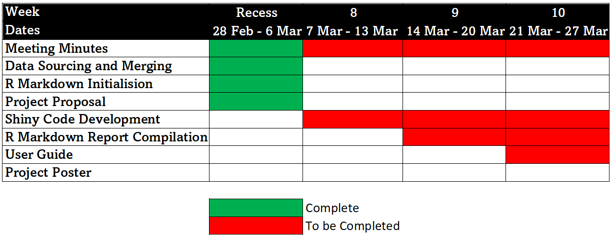
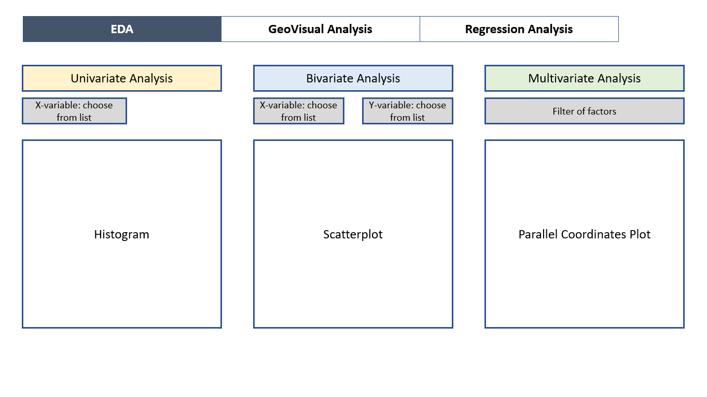
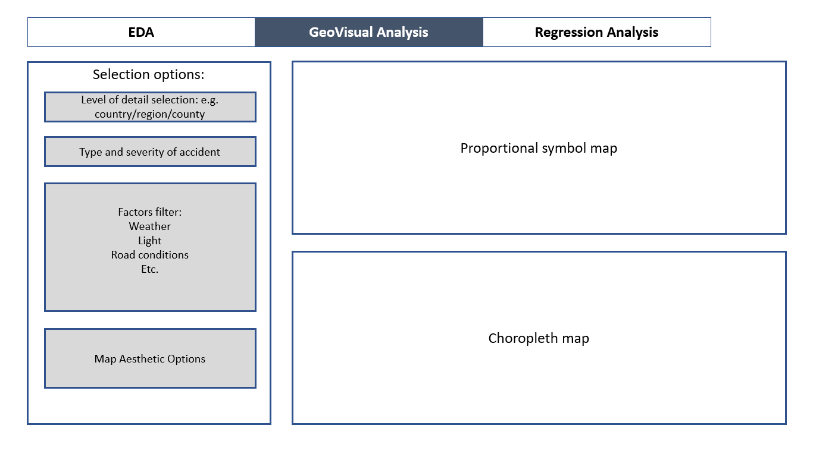
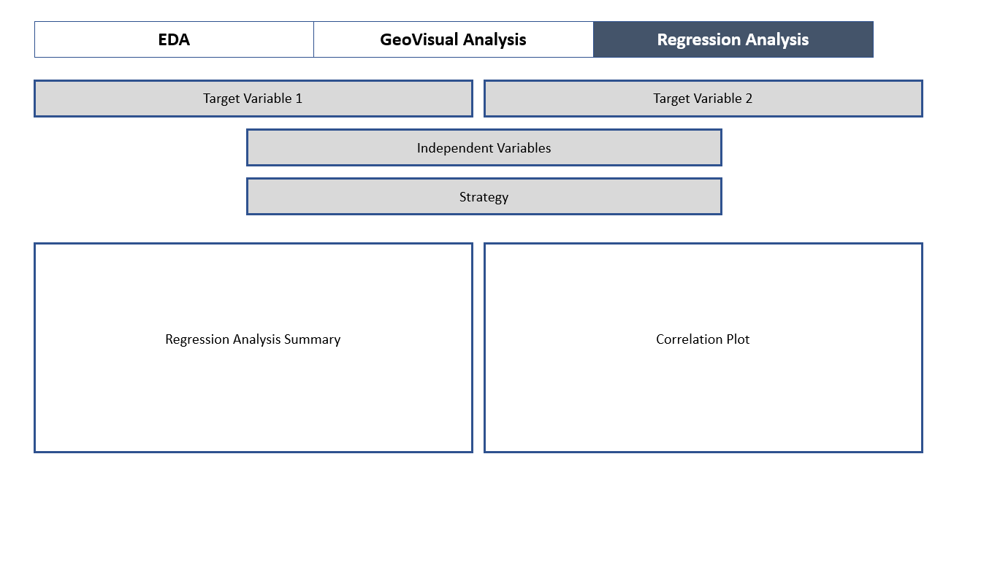

```{r, eval=TRUE,echo=FALSE}
setwd("C:/Users/Sean Prajs/Desktop/Visual Analytics/Group Project/Group 2 VA Project/Proposal")
```

# Background

Car accident occurs when a vehicle collides with another vehicle, pedestrian, animal, road debris, or other stationary obstruction, such as a tree, pole or building. These collisions often result in physical injury, disability or even death as well as property damage. 

According to World Health Organization (WHO), nearly 1.25 million people die in road crashes each year, on average 3,287 deaths a day. In addition, road traffic crashes rank as the 9th leading cause of death and account for 2.2% of all deaths globally. Hence, road safety has became a pressing concern for many countries as severe losses to both the society and the individuals involved are incurred when these tragedies happen. These losses arise from the cost of treatment as well as lost productivity for those killed or disabled by their injuries.

In the UK, the number of road deaths plateaued from 2012 to 2019 at around 1,850 deaths a year, which is equivalent to an average of five per day. In fact, the UK government has a long-standing collection of national accident statistics coupled with in-depth accident data,  known as the Road Accident In-Depth Study(RAIDS). These records have been very influential in policy-making and formulation of regulations.

# Introduction and Motivation

For this project, we would be using road accidents and safety statistics provided by the [Department for Transport](https://www.gov.uk/government/collections/road-accidents-and-safety-statistics) from 2016 to 2020 to gain a better understanding of the car accident issue in the UK. The dataset consists of detailed road safety statistics about the circumstances of road accidents, including variables like the location of the accidents, road types as well as weather conditions etc. By utilizing various visualization analytics tools, we expect to shine light on 
the occurrences of road traffic accident (e.g. nature, causes, frequency) to develop insights and prevention mechanisms for traffic accidents and road safety in the UK.

# Project Objectives

The project aims to:  

+ conduct exploratory data analysis to understand the number and characteristics of car accidents in the UK
+ create interactive map for viewers to visualize the density of car accidents in various locations
+ provide an interactive and user-friendly visualization analytics platform for viewers to explore the dataset on their own
+ draw actionable insights based on the analysis to derive potential prevention mechanism to reduce car crashes in the future 

# Data Set Origins and other Literarture References

1. [Road traffic injuries](https://www.who.int/en/news-room/fact-sheets/detail/road-traffic-injuries)  
2. [Reported Road Casualties Great Britain](https://www.gov.uk/government/statistics/reported-road-casualties-in-great-britain-provisional-estimates-year-ending-june-2021/reported-road-casualties-in-great-britain-provisional-estimates-year-ending-june-2021#:~:text=There%20were%20119%2C850%20casualties%20of,the%20same%20period%20in%202020.)  
3. [Road accidents and safety statistics](https://www.gov.uk/government/collections/road-accidents-and-safety-statistics)  
4. [Road safety performance overview](https://assets.publishing.service.gov.uk/government/uploads/system/uploads/attachment_data/file/1014128/Road_Safety_Performance_-_Update.PDF)  

# Proposed Scope and Methodology
For our topic we will be building a Shiny app that allows the user to interactively
create and adjust different analysis techniques on our data to uncover insights
on traffic accident statistics in the United Kingdom.


Our proposed methodologies for the R Shiny tabs are:

1. Exploratory Data Analysis
2. Correlation Plot
3. Geo-Spatial Analysis and Factor-Filtered Geo-Spatial Analysis
4. Multivariate Regression Analysis


```{r, eval=TRUE,echo=TRUE}


```

# Timeline

We have agreed on the following timeline for the completion of our Visual
Analytics Project.



# Early Prototypes and Storyboard (Application Features)

## Application Features
The shiny application will consist of three main analytics sections, namely **(1)Exploratory Data Analysis (EDA)**, **(2)GeoVisual Analysis** and **(3)Regression Analysis**.

### EDA


### GeoVisual Analysis


### Regression Analysis


# R Packages Necessary
Given that we have not compiled the code yet, we cannot be sure of the final
list of R libraries and packages we will use. However, we have come up with a
preliminary list. A link to the library website is embedded in each package name.

### Data Cleaning Libraries

+ [tidyverse](https://www.tidyverse.org)
+ [lubridate](https://cran.r-project.org/web/packages/lubridate/index.html)

### Shiny Libaries

+ [shiny](https://shiny.rstudio.com)
+ [shinythemes](https://cran.r-project.org/web/packages/shinythemes)
+ [shinyWidgets](https://cran.r-project.org/web/packages/shinyWidgets)

### Potential Data Graphing and Mapping

+ [tmap](https://cran.r-project.org/web/packages/tmap)
+ [DT](https://cran.r-project.org/web/packages/DT)
+ [ggplot2](https://cran.r-project.org/web/packages/ggplot2/index.html)
+ [GGally](https://cran.r-project.org/web/packages/GGally)
+ [leaflet](https://cran.r-project.org/web/packages/leaflet)
+ [plotly](https://cran.r-project.org/web/packages/plotly)
+ [gganimate](https://gganimate.com/)
+ [ggiraph](https://cran.r-project.org/web/packages/ggiraph/index.html)

### Regression and Correlation Libaries

+ [corrplot](https://cran.r-project.org/web/packages/corrplot)
+ [car](https://cran.r-project.org/web/packages/car/index.html)
+ [stats](https://stat.ethz.ch/R-manual/R-devel/library/stats/html/00Index.html)
+ [rgdal](https://cran.r-project.org/web/packages/rgdal)
+ [rgeos](https://cran.r-project.org/web/packages/rgeos)
+ [MASS](https://cran.r-project.org/web/packages/MASS/index.html)
 
As a disclaimer we would like to point out that the package list above is not
exhaustive and we reserve the right to add and remove packages as we see
advantageous to our Shiny app or increasing its efficiency and/or effectiveness.


```{r setup, include=FALSE}
knitr::opts_chunk$set(echo = FALSE)
```

Distill is a publication format for scientific and technical writing, native to the web. 

Learn more about using Distill for R Markdown at <https://rstudio.github.io/distill>.


