```{r setup, include=FALSE}
knitr::opts_chunk$set(echo = FALSE)
```

# 1. Exploratory Data Analysis
Use this tab to run uni-variate and bi-variate analysis on selected variables.

## 1.1 Input Variable Selection
Users can choose from two sets of variables, namely the **Environment Conditions** and **Accident Conditions**.

Environment conditions are those related to the external environment factors when an accident occurs. Examples include light conditions, weather conditions, road surface conditions etc.

Accident conditions are conditions associated with the accident itself, examples of accident conditions include severity of accident, number of casualties and number of vehicles involved.

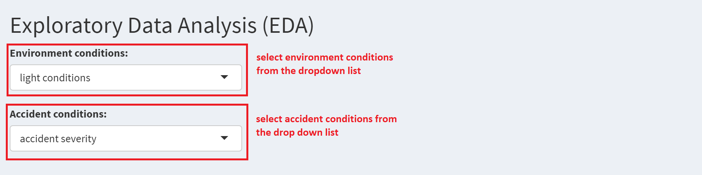


## 1.2 Univariate Analysis on Accdident Count Distribution
After the selection of input variables, the app will run univariate analysis and return the accident count distribution based on the input selected.

The bar chart on the right will show distribution of accident based on the selected environment condition and the bar chart on the right will show the distribution based on selected accident condition.

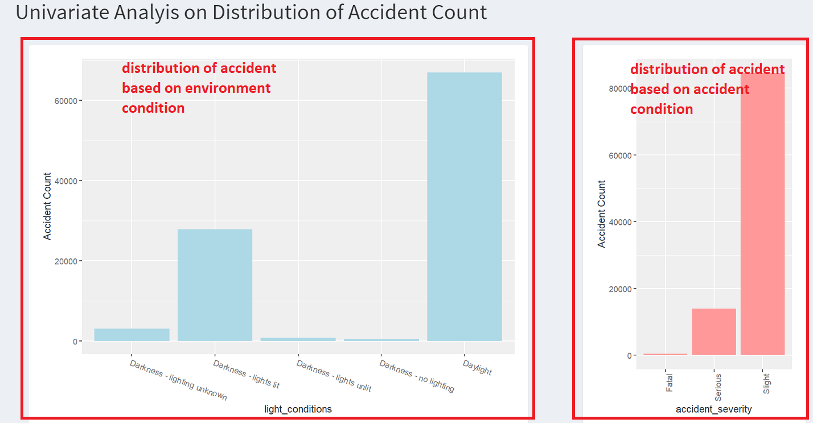


## 1.3 Bivariate Chi-Square Analysis on Environment and Accident Conditions
Based on the above selected environment conditions (light conditions) and accident conditions (accident severity), the app will run chi-square test of independence on the two categorical variables. Test result below shows a small p-value and indicates a significant association between light conditions and accident severity.


After the results of the chi-square test, the app will also display a balloon plot to visualise the frequency table used to run the chi-square test based on selected environment and accident conditions. The balloon plot draws a graphical matrix where each cell contains a dot whose size reflects the relative magnitude of the corresponding frequency.

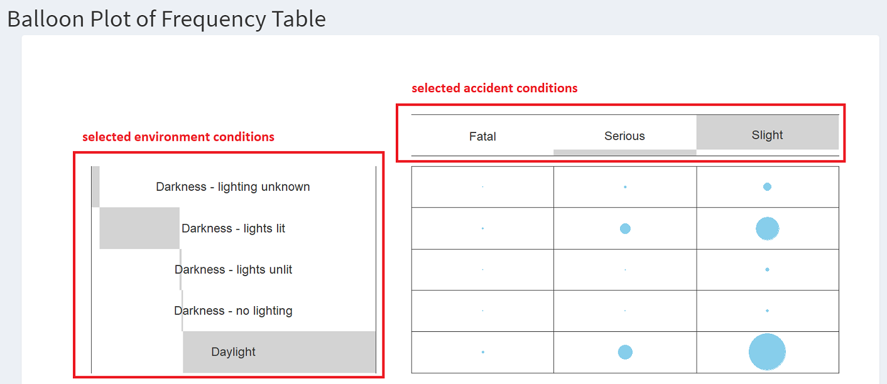


Next, the app will display a correlation plot on chi-square residuals based on selected environment and accident conditions. Positive residuals are in blue. Positive values in cells specify an attraction (positive association) between the corresponding environment and accident variables. Negative residuals are in red. This implies a repulsion (negative association) between the corresponding environment and accident variables.

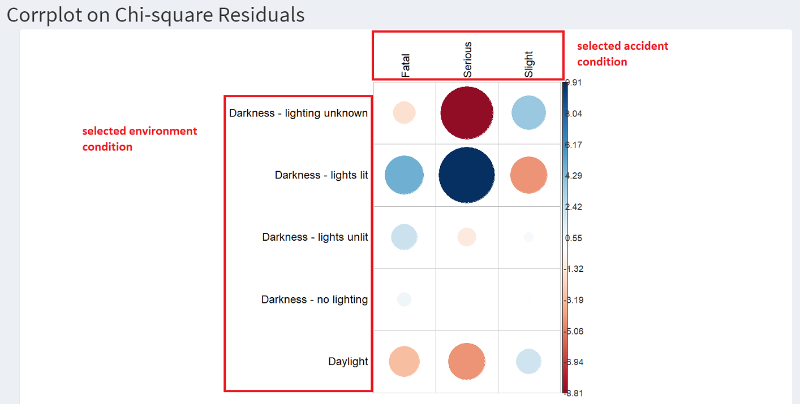


Last but not least, the raw frequency table generated based on selected environment and accident conditions will be desplayed for reference purposes.

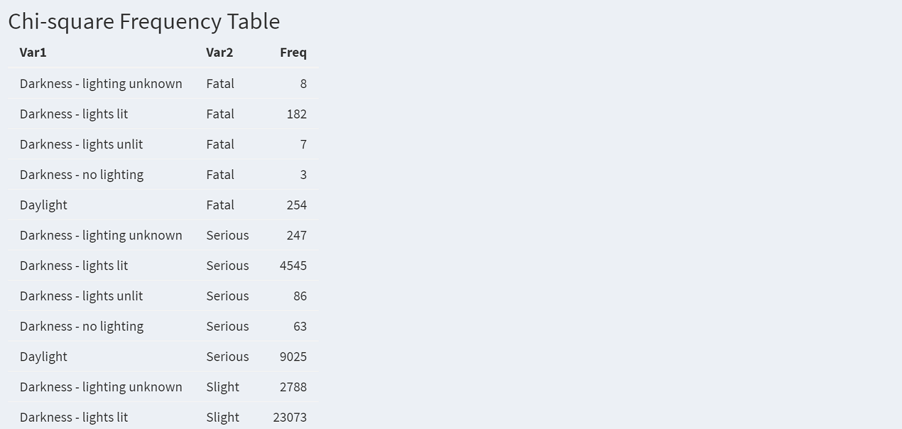

# 2. GeoVisual Analysis
In this tab, the user could have exploratory spatial data visualization on the occurrences of car accidents within various boroughs across Greater London from a geographical perspective using a choropleth map. 

The user could generate a customized map through changing the 4 variables inside the sidebar panel. In terms of classification, the user could select the method from the drop-down list and change the number of classes by using the slider. Next, the user can choose the 'year' and 'accident severity' of their interest by using the drop-down list. Finally, click on 'Apply Changes' and all the changes in the variables will be reflected on the map. By hovering over and clicking onto a particular borough, the specific number of accidents would be shown in the tooltip. 

Note: For the map to first appear the user will have to initialise it by clicking on "Apply Changes".

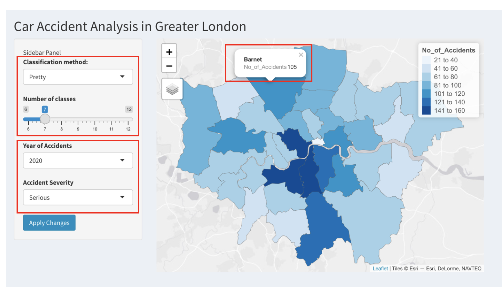


# 3. Regression Analysis
In this tab the user can run multivariate linear regressions on the different factors and target variables.

## 3.1 Target Variable Selection
There are two target variables to choose from in the tab: 1. Number of Casualties 2. Accident Severity.

Note, you cannot choose two target variables at the same time.

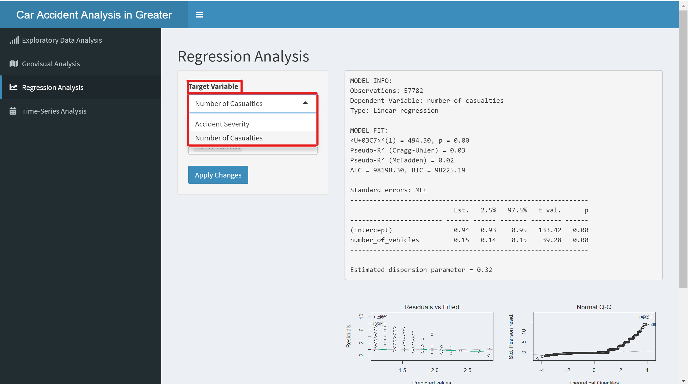

#3.2 Indpendent Variable Selection

The user can choose the independent variables from a list as needed. Multiple
independent variables can be chosen and there is no limit as to how many the user
can choose.

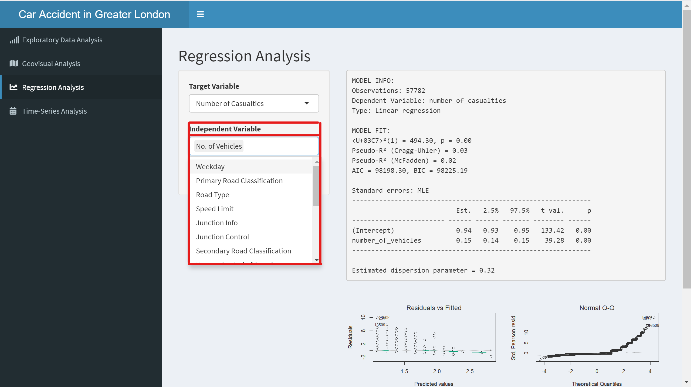

## 3.3 Model Output

The first output will show: 1. General Infromation on the model (red) 2. Attributes on 
the quality and validity of the model (orange) 3. The final regression values (yellow).

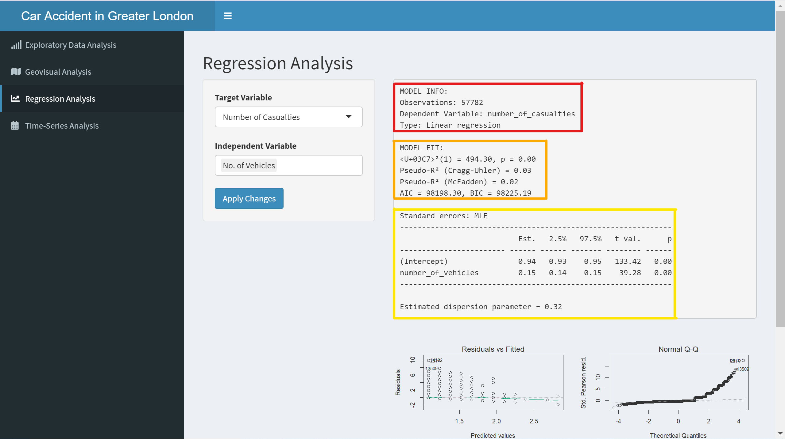

## 3.4 Residuals Plot

The second output will show the four different residual plots for the user to make
sure that the regression assumptions are met.

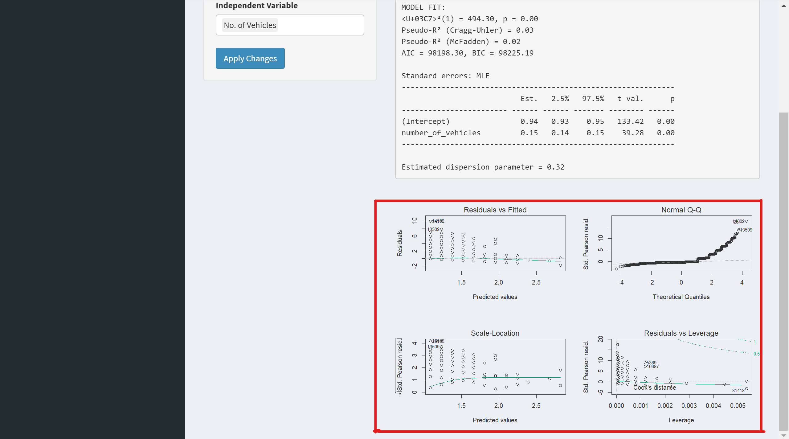

# 4. Time-Series Analysis

This tab can be used to analysis the trends of numeric variables over time from
2017 to 2020.

## 4.1 Y Variable Selection

There are three variables to select from the drop down menu under the y variable.

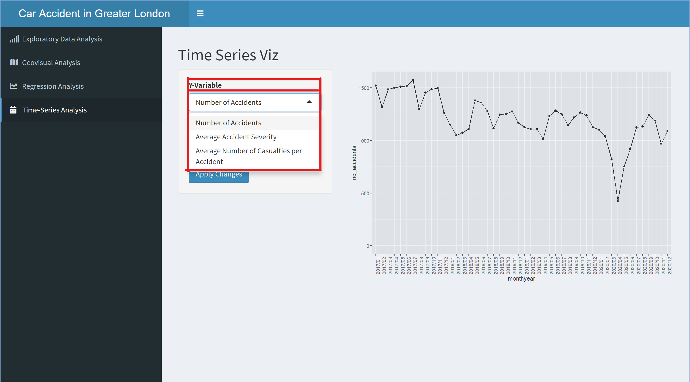

## 4.2 X Variable Selection

There is only one choice for the x variable. As this is a time-series analysis the
x variable must be time. In this application a year-month format is used.

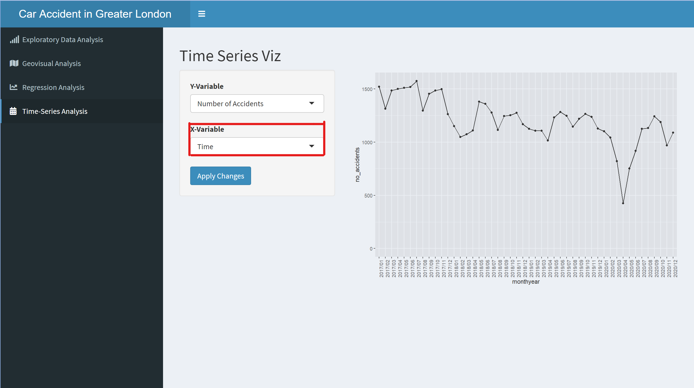


## 4.3 Output

The output of this tab is a time-series graph.

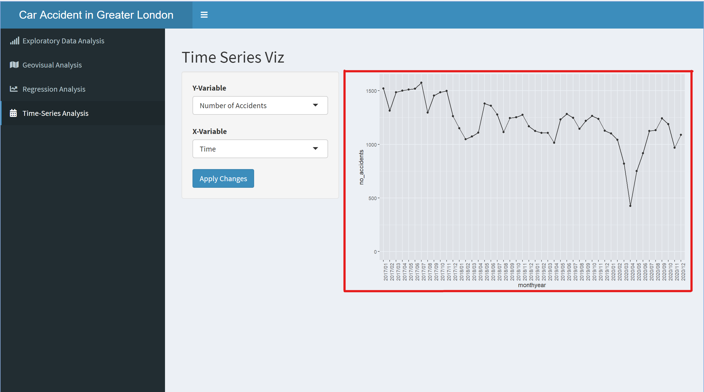


