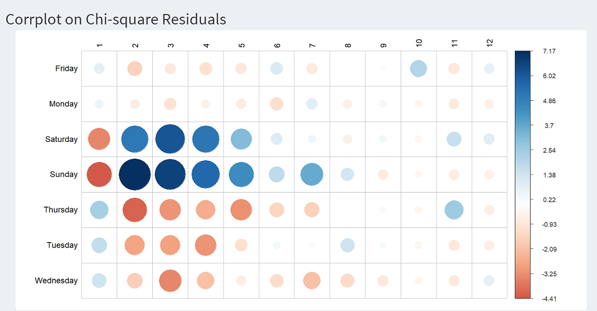
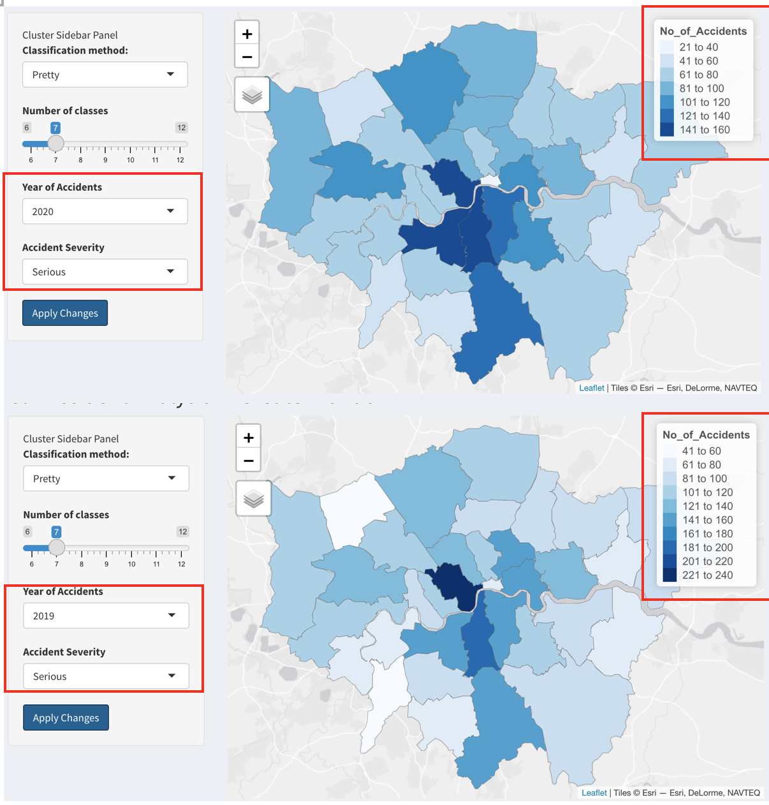
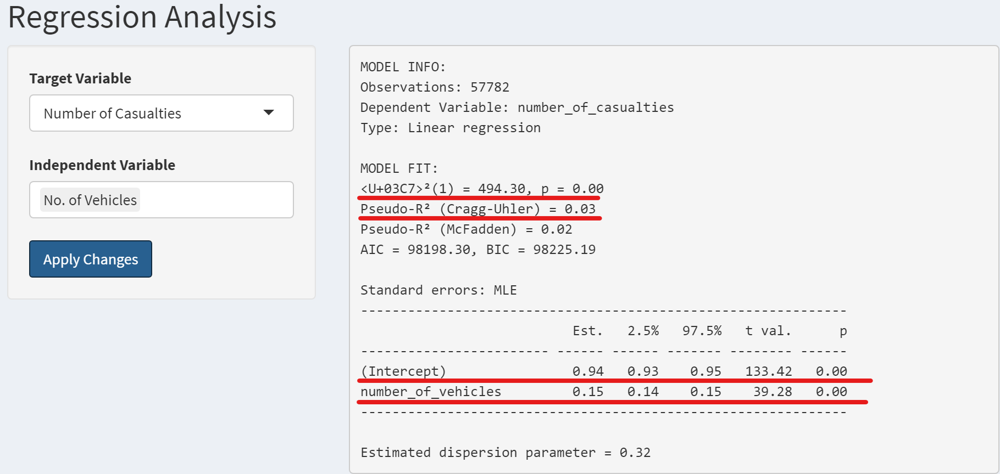
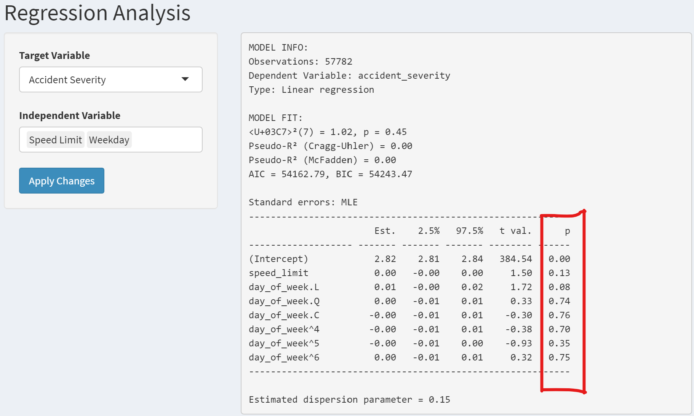
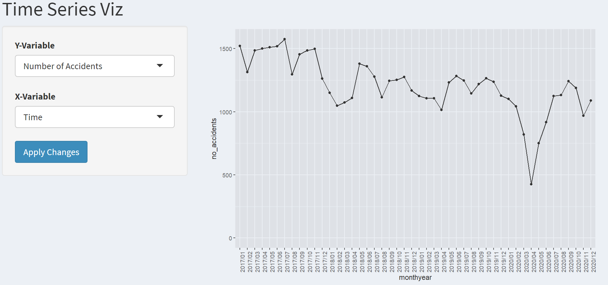

```{r setup, include=FALSE}
knitr::opts_chunk$set(echo = FALSE)
```

# Background

Car accident occurs when a vehicle collides with another vehicle, pedestrian, animal, road debris, or other stationary obstruction, such as a tree, pole or building. These collisions often result in physical injury, disability or even death as well as property damage.

According to World Health Organization (WHO), nearly 1.25 million people die in road crashes each year, on average 3,287 deaths a day. In addition, road traffic crashes rank as the 9th leading cause of death and account for 2.2% of all deaths globally. Hence, road safety has became a pressing concern for many countries as severe losses to both the society and the individuals involved are incurred when these tragedies happen. These losses arise from the cost of treatment as well as lost productivity for those killed or disabled by their injuries.

In the UK, the number of road deaths plateaued from 2012 to 2019 at around 1,850 deaths a year, which is equivalent to an average of five per day. In fact, the UK government has a long-standing collection of national accident statistics coupled with in-depth accident data, known as the Road Accident In-Depth Study(RAIDS). These records have been very influential in policy-making and formulation of regulations.

# Introduction and Motivation

For this project, we would be using road accidents and safety statistics provided by the UK Department for Transport from 2017 to 2020 to gain a better understanding of the car accident issue in the Greater London area. The dataset consists of detailed road safety statistics about the circumstances of road accidents, including variables like the location of the accidents, road types as well as weather conditions etc. By utilizing various visualization analytics tools, we expect to shine light on the occurrences of road traffic accident (e.g. nature, causes, frequency) to develop insights and prevention mechanisms for traffic accidents and road safety in the UK.

# Approach

The traffic accident dataset will be hosted on a R shiny dashboard, and users will be able to perform 4 types of analysis on it.

+ Exploratory Data Analysis (EDA)
+ Geovisual Analysis
+ Regression Analysis
+ Time-series Analysis

# Results
## `Exploratory Data Analysis (EDA)`
The exploratory data analysis allows users to discover the relationship between the chosen environment conditions and accident conditions.

The chi-square test results will tell users whether there is a significant association between the chosen environment factor and the accident factor. For example, if we choose day of week as the environment condition and accident severity as accident severity, the chi-square test will return a p-value of 0.252, indicating no significant association between these two factor. Or in other words, there is no significant link between accident severity and on which day during the week does the accident occur. 

However, if we choose day of week and number of casualties, the corresponding p-value of the chi-square test is <2.2E-16, indicating a significant association between these two factors. In other words, the day of the week does affect the number of casualties should an accident occur.

From the below correlation plot on chi-square residuals, we can see there is an attraction or positive association between higher number of casualties (>=2) and weekends (Saturday and Sunday), while generally there is a repulsion or negative association between higher number of casualties and weekdays (Monday to Friday).

{height=120%, width=100%}

## `GeoVisual Analysis`
The GeoVisual analysis allows users to visualize the difference in number of car accidents among different boroughs across the Greater London county from a geographical perspective through selecting the 'classification method' and 'number of classes', 'year of accidents' as well as the 'accident severity' of their interest. From the choropleth map, it could be observed that overall, less severe accidents (slight and serious) are of higher occurrences compared to fatal accidents.

If we dive deep into the specific boroughs, less severe collisions are more frequent in developed boroughs such as London and Westminster with larger vehicle population and heavy traffic. However, fatal accidents tend to occur more often in the less developed boroughs close to the county boundaries, possibly due to the inadequate transportation infrastructure.

Moreover, there is a noticeable decrease in the number of car accidents in 2020. This may be because of lock-down policies implemented during the pandemic period, which resulted in reduced mobility generally.

{height=120%, width=90%}

## `Regression Analysis`

The regression analysis allows the user to explore correlation links between the two possible target variables and the independent variables. 

Given the flexibility of the selection and number of independent variables, there are a lot of potential results to discuss here. Therefore, in the interest of space only two regressions will be discussed.

The first regression will be number of casualties as the target variable and the number of vehicles involved in the accident as the explanatory variable. Although only 3% of the variation is explained by the model, there is a valid positive correlation between the two variables with an average increase of 0.15 casualties with each extra vehicle.

{height=120%, width=100%}

For the second regression we choose accident severity as the target variable and speed limit and day of week as explanatory variables. As can be seen below the p-values of all of these factors are too high to be significant. Therefore there is no measurable effect of either speedlimits or days of week on the severity of traffic accidents. This regression was chosen to showcase that factors that might seem correlated often are not.

{height=120%, width=100%}

## `Time-series Analysis`

For the time-series analysis, the most significant result can be seen when looking at the trend of number of accidents over time in the Greater London area. From 2017 through 2019 we seen a steady, yet fluctuating, decline in the average number of accidents.

In early 2020 there is a sharp drop in March and April before the average accident number returns to 2019 levels by the end of 2020. This drop is best explained by the start of the Covid-19 pandemic and the ensuing lockdown imposed on this geography. With easing restrictions traffic increased again and thus traffic accidents returned to their "normal" rate again.


{height=120%, width=100%}


# Future Improvements

In future, we can expand the scope of our study beyond the Greater London area to include the entire UK. With a larger dataset and expanded scope, the comprehensiveness of our study can be enhanced, and our analysis tools will be more effective in terms of both descriptive and predictive values.

Also, other related datasets can also be brought in to enhance the amount of insights offered by the application. For instance, it is feasible to look at the human aspect of accidents, such as the age or alcohol intoxication level of drivers.